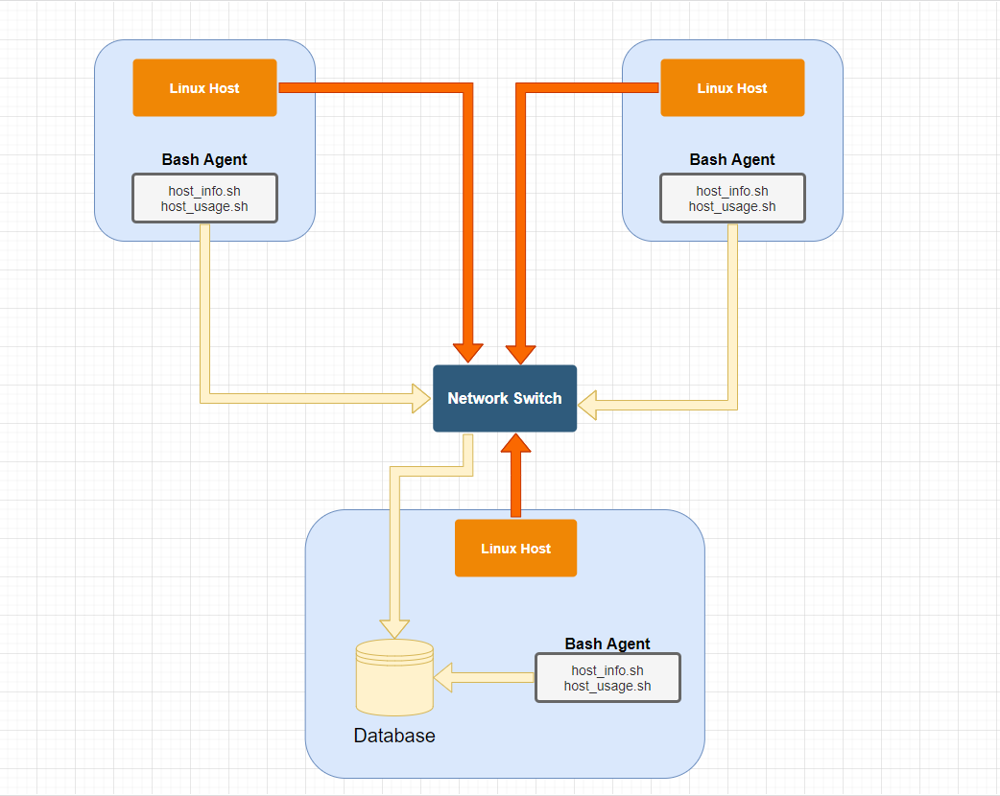

# Linux/SQL Monitoring Agent Project

## Introduction

The Jarvis Linux Cluster Admin (LCA) team manages a cluster of multiple nodes/servers that run on the CentOS 7 platform. These are connected via a local ethernet switch and communicate internally via IPv4 addresses. 
The purpose of this project is to implement an architecture that will allow for monitoring/usage of these nodes (CPU/Memory) in real time and store these onto a RDBMS database for retrieval via scripts. (PostgreSQL, Linux Bash).

To elaborate in further detail, a PostgreSQL instance is provisioned with Docker, with a host_agent database containing 2 scripts that collect hardware information and CPU/Memory information, respectively.

###### Host Agent
`host_info.sh`
This script file collects all information regarding host hardware, by parsing through a command via Linux bash.

`host_usage.sh`
This script file collects all information regarding host hardware, by parsing through a command via Linux bash. This is a script that must be automated, so a `crontab` job is used to deploy this every minute.

In addition, SQL queries have been run on this database to retrieve business model questions such as average memory usage.

The source code of this project is stored on a remote GitHub Repository. 


## Quick Start
Quick start commands used to initialize project steps:
- Start a psql instance using psql_docker.sh
```
#Starting the PSQL Docker script.
./scripts/psql_docker.sh start
```

- Create tables using ddl.sql
```
#Execute ddl.sql script on the host_agent database against the psql instance
psql -h localhost -U postgres -d host_agent -f sql/ddl.sql
```

- Insert hardware specs data into the database using host_info.sh
```
./scripts/host_info.sh localhost 5432 host_agent postgres password
```

- Insert hardware usage data into the database using host_usage.sh
```
bash scripts/host_usage.sh localhost 5432 host_agent postgres password
```

- Crontab setup
```
* * * * * bash /home/centos/dev/linux_sql/host_agent/scripts/host_usage.sh localhost 5432 host_agent postgres password > /tmp/host_usage.log
```


## Implemenation
Discuss how you implement the project.

### Architecture


### Scripts
Shell script description and usage (use markdown code block for script usage)
- psql_docker.sh
*The `psql_docker` script comes with 3 options: create, start & stop. These can be initialized as per demonstrated code below:*
```
#Creating a psql_docker instance with a username and password.
./scripts/psql_docker.sh create db_username db_password

#Starts a docker instance.
./scripts/psql_docker.sh start

#Stops a docker instance.
./scripts/psql_docker.sh stop
```
- host_info.sh and host_usage.sh
*The `host_info.sh` and `host_usage.sh` scripts collect information on hardware and CPU/Memory usage, respectively. A hostname, port number, database name, and username/password for psql are needed as inputs.*
```
#There are a total of 5 inputs after the script: host,port #, db name, psql user, psql password.
./scripts/host_info.sh localhost 5432 host_agent postgres password

#There are a total of 5 inputs after the script: host,port #, db name, psql user, psql password.
bash scripts/host_usage.sh localhost 5432 host_agent postgres password
```
- crontab
*The crontab command allows you to automate the process for calling the host_usage.sh script.*
`crontab -e`
*Then inside the crontab editor:*
```
* * * * * bash /home/centos/dev/linux_sql/host_agent/scripts/host_usage.sh localhost 5432 host_agent postgres password > /tmp/host_usage.log
```
- queries.sql
*There are a series of business problems that are pending to be solved, including average memory usage and tracking crontab failures. These can be solved by the bulit in SQL queries embedded in the script.*
```
#Executing the SQL file against the host_agent database that is created. 
#This command requires a hostname, port #, username, database name, and finally the sql file name that is to be run against the database.
psql -h localhost -p 5432 -U postgres -d host_agent -f queries.sql
```

### Database Modeling
Describe the schema of each table using markdown table syntax (do not put any sql code)
- `host_info`
id | hostname | cpu_number | cpu_architecture | cpu_model | cpu_mhz | L2_cache | total_mem | timestamp
--- | --- | --- | --- | --- | --- | --- | --- | ---
SERIAL NOT NULL PRIMARY KEY | VARCHAR NOT NULL UNIQUE | INT NOT NULL | VARCHAR NOT NULL | VARCHAR NOT NULL | FLOAT(3) | INT NOT NULL | INT NOT NULL | TIMESTAMP NOT NULL

- `host_usage`
timestamp | host_id | memory_free | cpu_idle | cpu_kernel | disk_io | disk_available
--- | --- | --- | --- | --- | --- | --- | --- | ---
TIMESTAMP NOT NULL | SERIAL REFERENCES host_info(id) NOT NULL | INT NOT NULL | INT NOT NULL | INT NOT NULL | INT NOT NULL | INT NOT NULL 


## Testing
Testing of bash scripts and SQL queries was done on local machine, via Linux Bash, and Intellij console for SQL queries in order to gather the remote data of nodes. Theoretically, if scripts/queries are found to be successful on a single node, then the same can be said for the other nodes in the cluster, thus guaranteeing success. 

## Deployment
- Scripts were deployed via bash commands for Docker instances and hardware,CPU and Memory data. 
- Application was deployed every minute via a `crontab` job and source code hosted on GitHub.


## Improvements
For my future outlook on software projects, there are 3 critical areas in which I want to improve on:
1. Understanding and being able to fluidly adapt to new software interfaces and be more comfortable with general system architectures. 
2. Develop a stronger foundation on the fundamental software commands/tricks and not always refer to manuals/google search.
3. Strengthen my research skills and enable myself to retrieve general information of any item of hand with greater ease (reading linux manuals, understanding code via google, etc).

